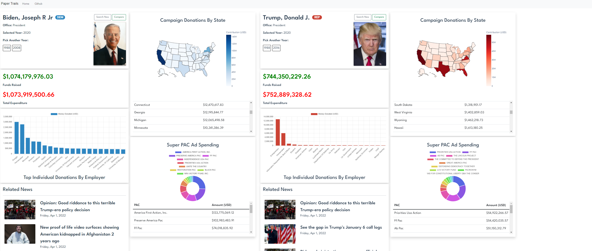

# Paper Trails
### Iyad, Joey, Mark

Paper Trails sheds light on the financial backings of **all** federal political candidates, including Representative, Senators, and Presidents. This website compiles big data from the Federal Election Commission, which are normally hard to find and harder to understand, into **easily digestable** information in a **user-friendly** interface.

This project was coded in 24 hours for [SHS Hacks 2022](https://shshacks.io/). The code can be found [here](https://github.com/JosephShepin/shs-hacks-2022) on [GitHub](https://github.com/).

### Languages
- [Python](https://www.python.org/)
- [Vue.js](https://vuejs.org/)
- [English](https://en.wikipedia.org/wiki/English_language)
### Libraries/APIs
- [OpenFEC](https://api.open.fec.gov/)
- [Plotly](https://plotly.com/graphing-libraries/)
- [DuckDuckGo Image API](https://github.com/deepanprabhu/duckduckgo-images-api)
- [Flask](https://flask.palletsprojects.com/en/2.1.x/)
- [Chart.js](https://www.chartjs.org/)
- [Flask-Cors](https://pypi.org/project/Flask-Cors/)
- [python-dotenv](https://pypi.org/project/python-dotenv/)
### General Shoutouts
- [Stackoverflow](https://stackoverflow.com/)

## __*The advancement and diffusion of knowledge…is the only guardian of true liberty.*__

<em><h2>James Madison</h2></em>
